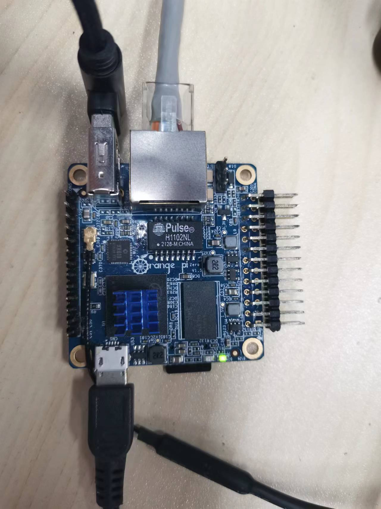
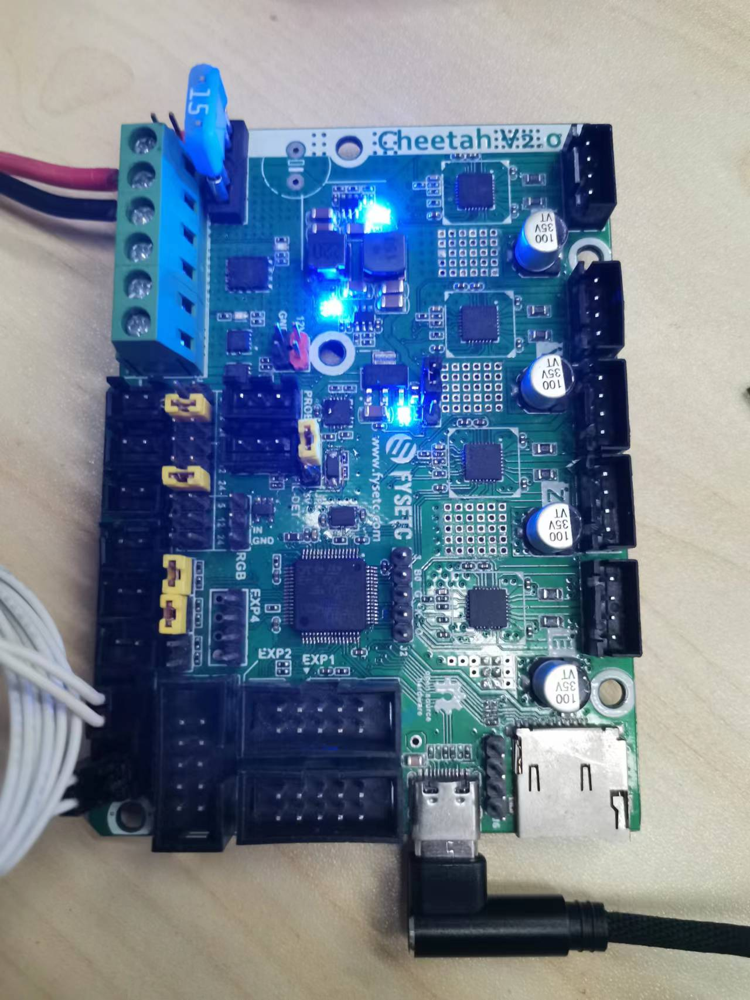

# OS

## SAMFi-OS_OrangePi_zero

Before you config the SAMF-OS_OrangePi-zero. You need an TF card with at least 8G capacity. 

### Step 1

Download and flash the OS image with `balenaEtcher` software to your TF card. Insert your flashed TF card to OrangePi-zero and connect Ethernet cable then power on. Find the ip address of OrangePi-zero on your router.



### Step 2

You can find the firmware `klipper.bin` in `OrangePi-zero` folder after you download the github repository. It is also stay in the OS path `firmwares\cheetah2.0.bin` after you login the OS with SSH.

Original SSH account and password:

```
account: fysetc
password: fysetc123
```

Enter DFU mode(set a jumpper on `3` and `B0` pin and re-power on the board ), and flash the firmware with the command below after you connect your OrangePi and Cheetah with USB cable.

```
dfu-util -R -a 0 -s 0x08008000:leave -D firmwares/cheetah2.0.bin
```

Or follow the instructions [here](https://github.com/FYSETC/FYSETC-Cheetah-v2#53--firmware-upload) for firmware uploading.



### Step 3:

Prepare the `pinter.cfg`, using the command below

```
cp klipper_config/cheetah2.0.cfg firmware/printer.cfg
```

You probably need to change `id` by `ls /dev/serial/by-id` command.

I use the generic klipper config for this example, you need to change it according to your machine. Now visit the webpage with your orangepi-zero IP address. Good to go.
