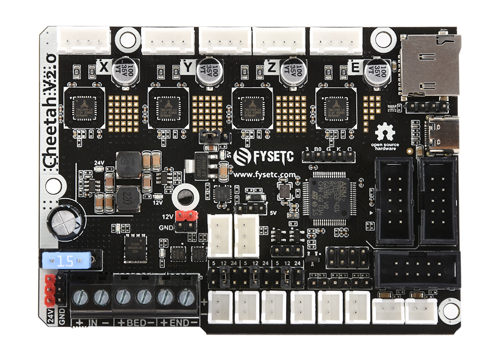
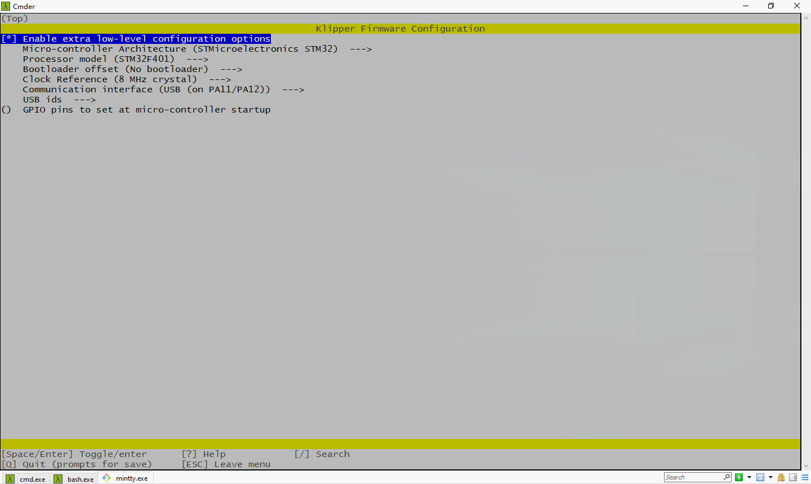

# Cheetah v2.0



## 1. Product Introduction

Cheetah 2.0 is a single-head main control board based on STM32F401, with 4 TMC2209 onboard, supports sensor-less homing, can be connected to a variety of displays, compatible with the installation size of most of the Creality 3D machines, such as ender3, ender3 V2, ender3 pro, ender5, and is also suitable for general 3D printers DIY.

## 2. Features

- Compact size: 101.5mm x 72mm，Compatible with the Creatlity ender 3 motherboard size
- Fully integrated all in one solution: 
- **STM32F401MCU (Run Marlin 2.0****/****Klipper** **)** 
- 4X TMC2209 stepper drivers, Support sensor-less homing
- UNIVERSAL POWER: 
- ​    Can be used with 12V/24V for motors / heated bed 
- ​    24V to 12V/2A DC-DC for fans 
- ​    Integrated high precision power regulators (DC/DC): 5V 2A Max and 3.3V 600mA Max LDO 
- ​    12V&24V power pin out 
- Onboard TF card socket- EXP3 for 12864 display panel (Creality 12864 panel or FYSETC Generic12864)
- **EXP1&EXP2 RepRapDiscount SmartController compatible pin header on board**
- **EXP4 with I2C and UART1**
- Onboard 5V WS2812 RGB control 
- SD card & USB upload support
- Car fuses for main power input
- **Up to 3 ways PWM fans** **(5/12/24 Optional)**
- PCB： FR4-TG155 PCB - Gold ENIG finishing

## 3. Application

- 3D printer 
- CNC Device
- Other similar machines

## 4. Hardware

### 4.1 Hardware Reasources

| Board Name           | Cheetah v2.0                                         |
| -------------------- | ------------------------------------------------ |
| License              | GPL V2.0                                       |
| Latest Version       | V2.0                                           |
| Extruders            | 1                                                |
| Controlled Fans      | 3 Max                                            |
| Heaters              | 2 Max                                            |
| Endstops             | 3 Max                                            |
| Temp sens            | 2 Max                                            |
| UART | 1 |
| I2C                  | 1                                                |
| SWD                  | 1                                                |
| USB   | 1                                            |
| CPU                  | STM32F401                                  |
| CPU Speed ( MHz )    | 84 Mhz                                       |
| Stepper driver       | 4X TMC2209 |
| Stepper driver Type              | Onboard               |
| Input| 12v/24v |
| Output| BED OUT：10A Max ；Heater Out：5A Max            |

### 4.2 Connectors and jumpers define
Coming soon...
### 4.3 Pin Definition
<table>
   <tr><td>Features</td><td>Cheetah Pin</td><td>STM32 Pin</td><td>Pin No.</td><td>Comment</td></tr>
   <tr><td rowspan="3">X-MOTOR(1)</td><td>X-Step</td><td>PC0</td><td>8</td><td></td></tr>
   <tr><td>X-DIR</td><td>PC1</td><td>9</td><td></td></tr>
   <tr><td>X-EN</td><td>PA8</td><td>41</td><td></td></tr>
   <tr><td rowspan="3">Y-MOTOR(2)</td><td>Y-Step</td><td>PC14</td><td>3</td><td></td></tr>
   <tr><td>Y-DIR</td><td>PC13</td><td>2</td><td></td></tr>
   <tr><td>Y-EN</td><td>PC15</td><td>4</td><td></td></tr>
   <tr><td rowspan="3">Z-MOTOR(3)</td><td>Z-Step</td><td>PB9</td><td>62</td><td></td></tr>
   <tr><td>Z-DIR</td><td>PB8</td><td>61</td><td></td></tr>
   <tr><td>Z-EN</td><td>PC2</td><td>10</td><td></td></tr>
   <tr><td rowspan="3">E0-MOTOR(4)</td><td>E0-Step</td><td>PB2</td><td>28</td><td></td></tr>
   <tr><td>E0-DIR</td><td>PA15</td><td>50</td><td></td></tr>
   <tr><td>E0-EN</td><td>PD2</td><td>54</td><td></td></tr>
   <tr><td rowspan="2">TMC2209 SERIAL (UART2)</td><td>TX2</td><td>PA2</td><td>16</td><td></td></tr>
   <tr><td>RX2</td><td>PA3</td><td>17</td><td></td></tr>
   <tr><td rowspan="3">End-stops</td><td>X-MIN</td><td>PB4</td><td>56</td><td></td></tr>
   <tr><td>Y-MIN</td><td>PB3</td><td>55</td><td></td></tr>
   <tr><td>Z-MIN</td><td>PC2</td><td>10</td><td></td></tr>
   <tr><td rowspan="3">FAN</td><td>FAN0</td><td>PA14</td><td>49</td><td></td></tr>
   <tr><td>FAN1</td><td>PA13</td><td>46</td><td></td></tr>
   <tr><td>FAN2</td><td>PA1</td><td>15</td><td></td></tr>
   <tr><td rowspan="1">RGB</td><td>Neo-pixel</td><td>PB0</td><td>26</td><td>Can be used for fan4</td></tr>
   <tr><td rowspan="2">Heating</td><td>E0-Heater</td><td>PC6</td><td>37</td><td></td></tr>
   <tr><td>Heated-Bed</td><td>PC7</td><td>38</td><td></td></tr>
   <tr><td rowspan="2">Temperature</td><td>TE0</td><td>PC4</td><td>24</td><td></td></tr>
   <tr><td>TB</td><td>PC5</td><td>25</td><td></td></tr>
   <tr><td rowspan="8">EXP1</td><td>BEEP</td><td>PC9</td><td>40</td><td></td></tr>
   <tr><td>BTN_ENC</td><td>PC12</td><td>53</td><td></td></tr>
   <tr><td>BTN_EN2</td><td>PC11</td><td>52</td><td></td></tr>
   <tr><td>MISO</td><td>PA6</td><td>22</td><td></td></tr>
   <tr><td>BTN_EN1</td><td>PC10</td><td>51</td><td></td></tr>
   <tr><td>SCK</td><td>PA5</td><td>21</td><td></td></tr>
   <tr><td>CS</td><td>PA4</td><td>20</td><td></td></tr>
   <tr><td>MOSI</td><td>PA7</td><td>23</td><td></td></tr>
   <tr><td rowspan="2">UART</td><td>TX</td><td>PA9/TX1</td><td>42</td><td></td></tr>
   <tr><td>RX</td><td>PA10/RX1</td><td>43</td><td></td></tr>
   <tr><td rowspan="2">I2C</td><td>I2C2 SCL</td><td>PB10</td><td>29</td><td></td></tr>
   <tr><td>I2C2 SDA</td><td>PB11</td><td>30</td><td></td></tr>
   <tr><td rowspan="3">SWD Debug</td><td>SWDIO</td><td>PA13</td><td>46</td><td>only used for debugging now and can be used for other purposes.</td></tr>
   <tr><td>SWCLK</td><td>PA14</td><td>49</td><td>only used for debugging now and can be used for other purposes.</td></tr>
</table>


## 5. Firmware 

### 5.1 Marlin

Follow the steps below to compile the firmware yourself. More information [here](https://marlinfw.org/docs/basics/auto_build_marlin.html).

#### 5.1.1 Download Vscode + platformio

To compile the firmware , you need to install Visual Studio Code and the platformio pulg-in.

#### 5.1.2 Firmware config

You have two code source choices

##### Source 1

You can get Marlin code is in the `firmware/Marlin` folder in this repository [github](https://github.com/FYSETC/FYSETC-Cheetah/tree/master/firmware/Marlin) or [gitee](https://gitee.com/fysetc/FYSETC-Cheetah/tree/master/firmware/Marlin). 

##### Source 2

Also you can get upstream branch from [github](https://github.com/MarlinFirmware/Marlin) or [gitee](https://gitee.com/fysetc/Marlin) (You'd better use the bugfix-2.0.x version as i just make [PR](https://github.com/MarlinFirmware/Marlin/pull/23104)  2021/10/10, so Marlin group may not integrate the code in formal version). Remember to change `default_envs` in `platformio.ini` file.

```
default_envs = FYSETC_CHEETAH_V20
```

And change `MOTHERBOARD` define according to your cheetah board version in `Configuration.h`

```
#define MOTHERBOARD BOARD_FYSETC_CHEETAH_V20
```

And serial port

```
#define SERIAL_PORT -1
#define BAUDRATE 115200
```

##### Change configuration

You need to modify your `configuration.h` and `configuration_adv.h` according to your machine. You'd better change your configuration base on the configuration in github [cheetah v1.1](https://github.com/MarlinFirmware/Configurations/tree/import-2.0.x/config/examples/Creality/Ender-3/FYSETC%20Cheetah)/[cheetah v1.2](https://github.com/MarlinFirmware/Configurations/tree/import-2.0.x/config/examples/Creality/Ender-3/FYSETC%20Cheetah%201.2) or gitee [cheetah v1.1](https://gitee.com/fysetc/Configurations/tree/import-2.0.x/config/examples/Creality/Ender-3/FYSETC%20Cheetah)/[cheetah v1.2](https://gitee.com/fysetc/Configurations/tree/import-2.0.x/config/examples/Creality/Ender-3/FYSETC%20Cheetah%201.2). Then you can compile the firmware now.

#### 5.1.3 Compile the firmware

Open Vscode and open platformio main page and click the "Open Project" button , and direct to the folder where you put your firmware.


If everything goes fine , at the bottom you can see several buttons


Just click check mark to compile. 

### 5.2 Klipper

Till now(2021/11/30), Klipper don't have boot offset setting for STM32F401 chip, so we use `no Bootloader` option first.



````
make clean
make
````

Then follow the Firmware Upload section below the upload the firmware.

## 5.3  <span id="jump0">Firmware Upload</span>

We provide several ways to upload the firmware .

### 5.3.1 <span id="jump1">Upload the firmware(SDCARD)</span>

*If you use Klipper firmware with `No bootloader` option, you can't use this method.* 

Uploading firmware using SD card is our default way to update the firmware as `Cheetah v2.0` already has the `bootloader` on it when it leave the factory. But if you once upload the firmware to `Cheetah v2.0` flash address `0x08000000`, then the bootloader in `Cheetah v2.0` will be gone, then you need to upload the bootloader to `Cheetah v2.0` yourself, please follow the README in bootloader folder ([github](https://github.com/FYSETC/FYSETC-SPIDER/tree/main/bootloader) or [gitee](https://gitee.com/fysetc/FYSETC-SPIDER/tree/main/bootloader)) to upload the bootloader.

##### How to upload firmware with bootloader

Copy your compiled firmware file ```firmware.bin```(If you use klipper firmware, you need to rename `klipper.bin` to `firmware.bin`) file to the SD card , and insert it to the SD card slot which is at the right side of the board, and then power up the board. You may need to wait for about 30s to finish uploading. When finished firmware name will change to `old.bin`. 

### 5.3.2 <span id="jump4">Upload the firmware(dfu-util)</span>

This method works in linux, that means should work in raspberry pi.

1. Enter DFU mode first

   - First power off the board
   - Place jumper on BT0 and 3.3V pin 
   - Connect USB cable to the board and your computer 
   - Power up the board with 24v 

1. Make sure dfu-util is installed, shoot `dfu-util --version` command to check.

   Sample output:

   ```
   dfu-util 0.9
   
   Copyright 2005-2009 Weston Schmidt, Harald Welte and OpenMoko Inc.
   Copyright 2010-2016 Tormod Volden and Stefan Schmidt
   This program is Free Software and has ABSOLUTELY NO WARRANTY
   Please report bugs to http://sourceforge.net/p/dfu-util/tickets/
   ```

   If not , you should install it first, use the package manager of your distribution to get the latest version, like

   ```
   sudo apt-get install dfu-util
   ```

2. Power off board, remove SD Card, place jumper on BT0 and 3.3V. (Between Z- endstop and E0 driver) Connect Spider to PC/RaspberryPi with USB cable with jumper in place. Set U5V jumper closest to stepper driver modules to power Spider from the Pi USB, or power up with 24V. Verify 3.3V LED is lit and board is detected with `dfu-util --list`, should look something like

   ```
   <snip>
   Found DFU: [0483:df11] ver=2200, devnum=13, cfg=1, intf=0, path="1-1.3", alt=3, name="@Device Feature/0xFFFF0000/01*004 e", serial="STM32FxSTM32"
   Found DFU:<snip>
   ```

3. You should replace `firmware.bin` below with your built firmware bin file location like `out/klipper.bin`. At the moment(2021/11/30), Klipper don't have boot offset setting when you compile, so change the following offset address `0x08008000` to `0x08000000` if you use Klipper firmware.

   ```
   dfu-util -R -a 0 -s 0x08008000:leave -D firmware.bin
   ```

### 5.3.3 <span id="jump">Upload the firmware(WINDOWS DFU)</span>

The other way to upload the firmware is using DFU.

#### Step 1. Download stm32cubeprogrammer 

You can download it from ST website.

https://www.st.com/zh/development-tools/stm32cubeprog.html

Open the STM32CubeProgrammer software.


#### Step 2. Enter DFU mode

1. First power off the board
2. Place jumper on BT0 and 3.3V pin 
4. Connect USB cable to the board and your computer 
5. Power up the board with 24v 

Now the board is in DFU mode. 

***REMEMBER to remove the jumper if you finish uploading firmware or it will enter DFU mode again.***

#### Step 3. Upload the firmware

Now you can connect and flash the Spider board with stm32cubeprogrammer with the following operation.


Do as the red number shows in the screen shot.

1. Click the button to find the DFU port.
2. Connect the DFU 
3. Choose the "firmware.bin" file.
4. Fill in the 'Start address' with `0x08008000` (If you use Marlin). If you use Klipper and you choose no boot address on menuconfig when you compile Klipper, then set it `0x08000000`.
5. Start Programming

## 6. FAQ


To be done...

## 7. Tech Support
Please submit any technical issue into our [forum](http://forum.fysetc.com/) 
