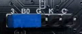
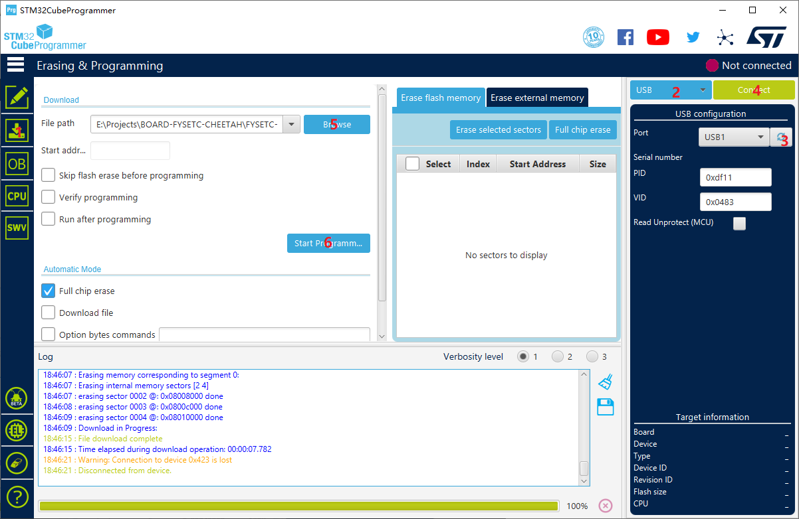

# Bootloader

There is `bootloader` named `FYSETC-BOOTLOADER-CHEETAH_V2.hex` file next to this `README` file.

## 1 Bootloader upload

We provide you two methods to upload the bootloader.

### 1.1 Method 1 : stm32cubeprogrammer

This method only works in windows.

#### Step 1. Download stm32cubeprogrammer 

You can download it from ST website.

https://www.st.com/zh/development-tools/stm32cubeprog.html

Open the STM32CubeProgrammer software.

#### Step 2. Enter DFU mode

1. First power off the board
2. Place jumper on BT0 and 3.3V pin 
3. Connect USB cable to the board and your computer 
4. Power up the board with 24v 

Now the board is in DFU mode. 

***REMEMBER to remove the jumper if you finish uploading firmware or it will enter DFU mode again.***

#### Step 3. Upload the firmware

Now you can connect and flash the Spider board with stm32cubeprogrammer with the following operation.

Do as the red number shows in the screen shot.

1. Jump to Erasing&Programming page.
2. Choose USB mode
3. Click the button to find the DFU port.
4. Connect the DFU 
5. Choose the `FYSETC-BOOTLOADER-CHEETAH_V2.hex` file.
6. Start Programming

## 2 Tech Support

You can raise issue in our github https://github.com/FYSETC/FYSETC-Cheetah-v2/issues
Or submit any technical issue into our [forum](http://forum.fysetc.com/) 